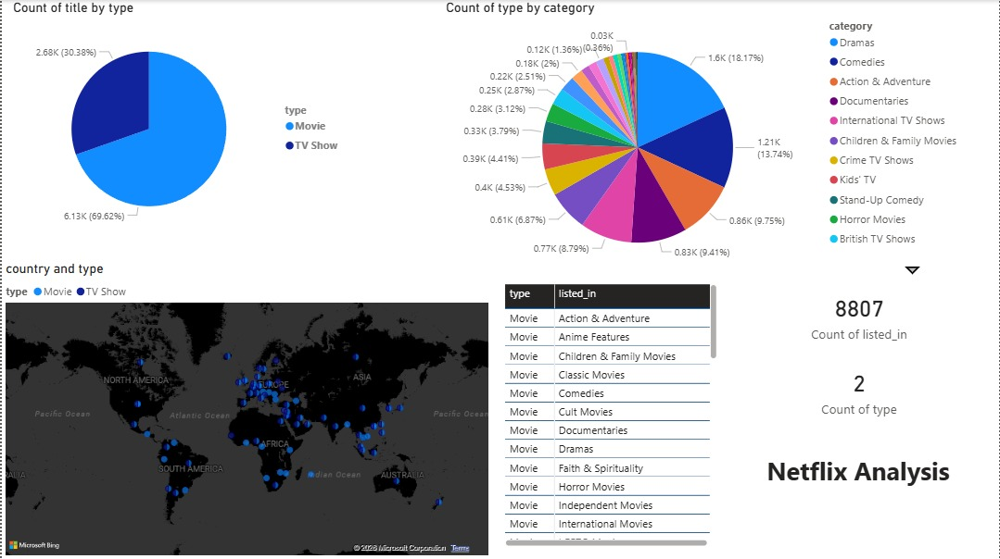

# 🎬 Netflix Data Visualization Dashboard (Power BI)

## 📌 Project Overview

This project presents an interactive **Netflix Data Visualization Dashboard** built using **Microsoft Power BI**.
The dashboard provides insights into Netflix content such as movies and TV shows, release trends, genres, ratings, and country distribution.

It helps users understand Netflix content patterns through visually appealing charts and filters.

---

## 📊 Dashboard Features

The dashboard includes:

* Total number of Movies and TV Shows
* Content distribution by **Type (Movie / TV Show)**
* Number of titles released per year
* Top genres available on Netflix
* Ratings distribution (TV-MA, PG, etc.)
* Country-wise content distribution
* Interactive slicers for:

  * Year
  * Genre
  * Country
  * Type

---

## 🛠 Tools & Technologies Used

* Microsoft Power BI
* Data Cleaning & Transformation using Power Query
* DAX (Data Analysis Expressions)
* Dataset: Netflix Titles Dataset
* Data Visualization Techniques

---

## 📁 Dataset Information

The dataset used in this project contains information about:

* Show ID
* Title
* Type (Movie / TV Show)
* Director
* Cast
* Country
* Release Year
* Rating
* Duration
* Genre
* Date Added

Dataset File:

```
netflix_dataset.csv
```

---

## 📸 Dashboard Preview



---

## 📈 Key Insights Generated

Some important insights from the dashboard:

* Movies are more frequent than TV Shows on Netflix.
* Content production increased significantly after 2015.
* Most content belongs to Drama and International genres.
* United States contributes the highest number of titles.
* TV-MA is the most common content rating.

---

## 🚀 How to Use This Project

1. Download the repository.
2. Open the file:

```
Netflix_Dashboard.pbix
```

3. Open using:

```
Microsoft Power BI Desktop
```

4. Interact with filters and visuals.

---

## 🎯 Project Objective

The main objective of this project is to:

* Analyze Netflix content trends
* Build interactive dashboards
* Demonstrate Power BI skills
* Perform data cleaning and visualization
* Present meaningful insights from raw data

---

## 👩‍💻 Author

**Arunima Nandi**

Skills Used:

* Power BI
* Data Visualization
* Data Analysis
* Dashboard Design

---

## ⭐ If You Like This Project

Give this repository a ⭐ on GitHub!
